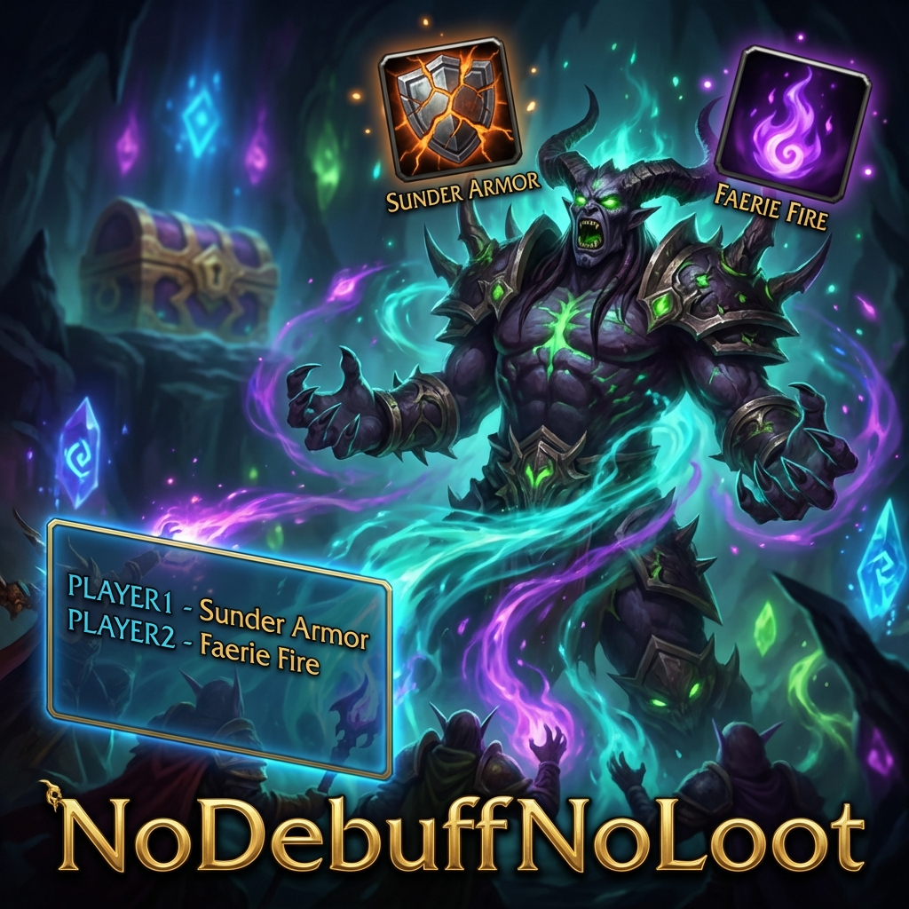

# NoDebuffNoLoot (TBC)

Addon designed to optimize raid performance in World of Warcraft TBC by strictly tracking critical debuffs on bosses.

## What does NoDebuffNoLoot do?

The addon identifies which essential debuffs (such as *Sunder Armor* or *Faerie Fire*) are missing from your target. Unlike other generic trackers, **NoDebuffNoLoot** allows you to assign each debuff to a specific raid player, making the responsibility for maintaining the debuff clear and visible to everyone.

## Information provided by the Addon

* **Dynamic Visual HUD**: A floating panel that shows icons for tracked debuffs customized by order of priority.
  * **Green (ACTIVE)**: The debuff is active and has enough time left (> 5s).
  * **Yellow (PENDING / EXPIRE)**: The debuff is not yet required (delay grace period active) or is about to expire (< 5s). Urgent renewal needed!
  * **Red Glow (MISSING)**: The debuff is strictly required during combat, grace period has expired, and it's missing.
* **Player Identification**: The HUD shows both the **Primary** and **Backup** assigned player's names next to each debuff.
* **Critical Alerts**:
  * **Visual**: The screen borders will pulse **Cyan** if a critical debuff assigned to you is missing during combat.
  * **Audio**: A "Raid Warning" sound will play to ensure you don't miss it.
  * **Chat**: A text log is printed to the chat window for post-combat review.
* **Convenience**:
  * **Minimap Icon**: Quick access to options via Right-Click, and Assignments via Shift-Click.
  * **Lock HUD**: Prevent accidental movement of the frame.
  * **Advanced Filters**: Hide assignments that aren't yours, restrict tracking to Boss encounters only, or show exclusively missing debuffs.

## Chat Commands

| Command | Action |
| :--- | :--- |
| `/ndnl` | Opens the configuration panel (Blizzard Menu). |
| `/ndnlsync` | Forces manual synchronization of assignments with all raid members using the addon. |

## Available Options

From the configuration panel (`/ndnl`), you can access general settings. However, clicking **Open Assignments Panel** gives you access to the core features:

1. **Manage Assignments**: A dynamic grid with autocomplete where you define the `Spell ID/Name`, the `Primary` person responsible, and a `Backup` player.
2. **Priorities**: Reorder rows using `^/v` to dictate HUD order and importance.
3. **Grace Period**: Configure a `Delay` in seconds for each spell to allow the tank/player time to apply it before alarms trigger.
4. **Announce to Raid**: Click the announce button to broadcast all assignments to Raid Warning and whisper individual players their specific roles.

## Tracked Debuffs by Class

| Class | Supported Spells |
| :--- | :--- |
| **Warrior** | Sunder Armor, Thunder Clap, Demoralizing Shout |
| **Druid** | Faerie Fire, Demoralizing Roar |
| **Hunter** | Hunter's Mark, Scorpid Sting |
| **Paladin** | Judgement of Light, Judgement of Wisdom, Judgement of the Crusader |
| **Warlock** | Curse of Elements, Curse of Recklessness, Curse of Weakness |

## Installation

1. Download the repository.
2. Copy the `NoDebuffNoLoot` folder into your `Interface/AddOns/` directory.
3. Ensure the libraries in the `Libs` folder are present.

---

---

## NoDebuffNoLoot (Español)

Addon diseñado para optimizar el rendimiento de las raids en World of Warcraft TBC mediante el rastreo estricto de los debuffs críticos en jefes.

## ¿Qué hace NoDebuffNoLoot?

El addon identifica qué debuffs esenciales (como *Hendedura de armadura* o *Fuego de hadas*) faltan en tu objetivo. A diferencia de otros rastreadores genéricos, **NoDebuffNoLoot** permite asignar cada debuff a un jugador específico de la raid, haciendo que la responsabilidad de mantener el debuff sea clara y visible para todos.

## Información proporcionada por el Addon

* **HUD Visual Dinámico**: Un panel flotante que rinde cuentas sobre los debuffs priorizados.
  * **Verde (ACTIVO)**: El debuff está activo y tiene tiempo suficiente (> 5s).
  * **Amarillo (PENDIENTE / EXPIRA)**: Aún no se requiere el debuff (está en periodo de gracia) o está a punto de expirar (< 5s).
  * **Destello Rojo (FALTA)**: Transcurrió el periodo de gracia en combate y la magia no se aplicó.
* **Identificación por Jugador**: El HUD muestra al "Encargado Principal" y al "Suplente" por cada debuff.
* **Alertas Críticas**:
  * **Visual**: Los bordes de la pantalla parpadearán en **Cian** si falta un debuff asignado a ti en combate.
  * **Audio**: Sonará un aviso tipo "Raid Warning" para asegurar la acción.
  * **Chat**: Se imprimirá un registro en texto local para auditorías post-combate.
* **Comodidad**:
  * **Icono de Minimapa**: Click derecho abre Opciones, Shift-Click abre Asignaciones.
  * **Filtros Avanzados**: Puedes "Mostrar solo Míos", "Solo Mostrar Faltantes" o "Rastrear Solo en Bosses".
  * **Bloqueo**: Bloquea el panel minimizando riesgos por clics accidentales.

## Comandos de Chat

| Comando | Acción |
| :--- | :--- |
| `/ndnl` | Abre el panel de configuración (Menú de Blizzard). |
| `/ndnlsync` | Fuerza la sincronización manual de las asignaciones con todos los miembros de la raid que usen el addon. |

## Opciones Disponibles

Desde el panel principal (`/ndnl`), puedes configurar alertas, pero el verdadero poder reside en abrir el **Panel de Asignaciones**:

1. **Gestión Dinámica**: Una lista de 3 columnas para elegir el `Hechizo / ID`, y usar autocompletado para el `Encargado` primario y su `Suplente`.
2. **Prioridades**: Organiza tus listas subiendo y bajando filas con las flechas `^/v`. Esto afecta en tiempo real la forma en la que se lee el HUD.
3. **Retraso en Combate**: Permite configurar un límite de segundos para aplicar la magia tras iniciar combate, evitando falsos positivos al quitear monstruos.
4. **Anuncios para Slackers**: Botón "Anunciar a Raid" que grita el listado general como Raid Warning, y al mismo tiempo susurra en privado por `/w` la responsabilidad individual de cada integrante en la sala.

## Debuffs Rastreados por Clase

| Clase | Hechizos Soportados |
| :--- | :--- |
| **Guerrero** | Sunder Armor, Thunder Clap, Demoralizing Shout |
| **Druida** | Faerie Fire, Demoralizing Roar |
| **Hunter** | Hunter's Mark, Scorpid Sting |
| **Paladín** | Judgement of Light, Judgement of Wisdom, Judgement of the Crusader |
| **Warlock** | Curse of Elements, Curse of Recklessness, Curse of Weakness |

## Instalación

1. Descarga el repositorio.
2. Copia la carpeta `NoDebuffNoLoot` en tu directorio `Interface/AddOns/`.
3. Asegúrate de que las librerías en la carpeta `Libs` estén presentes.
